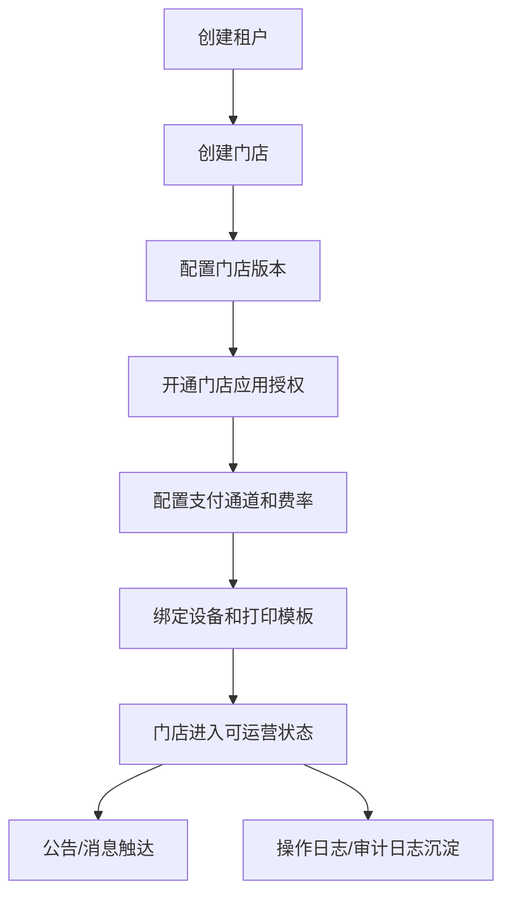
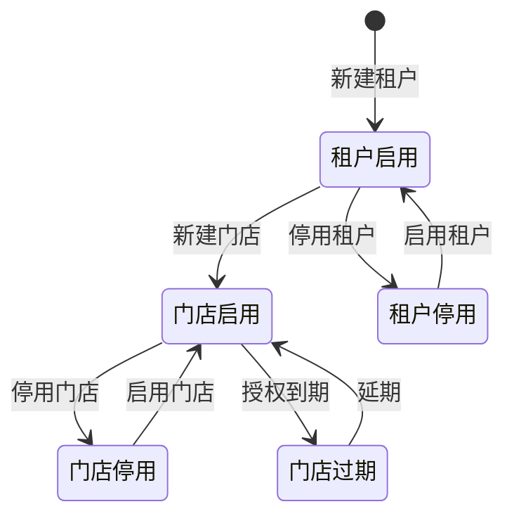
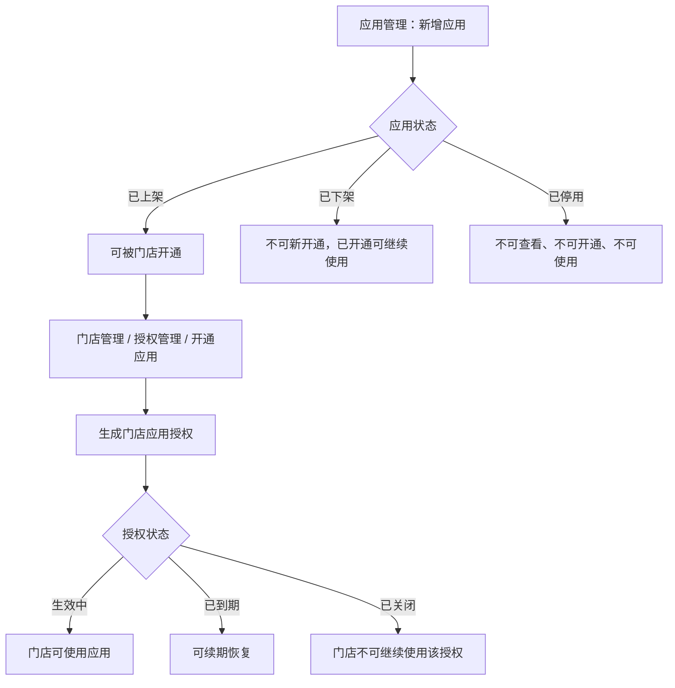
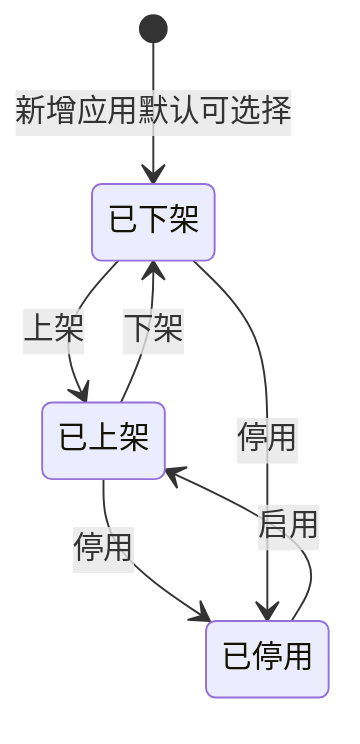
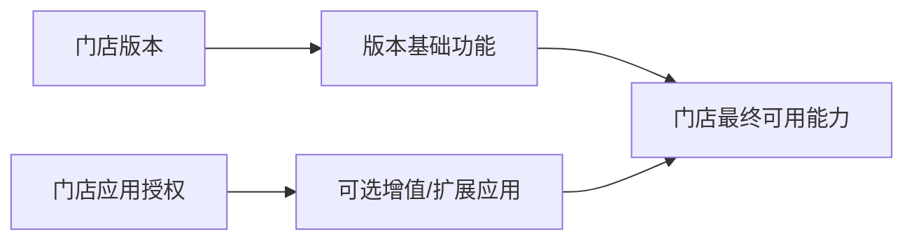
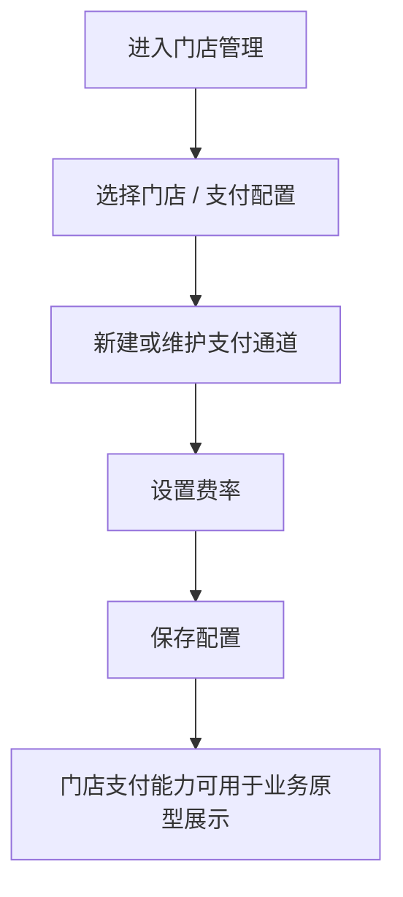
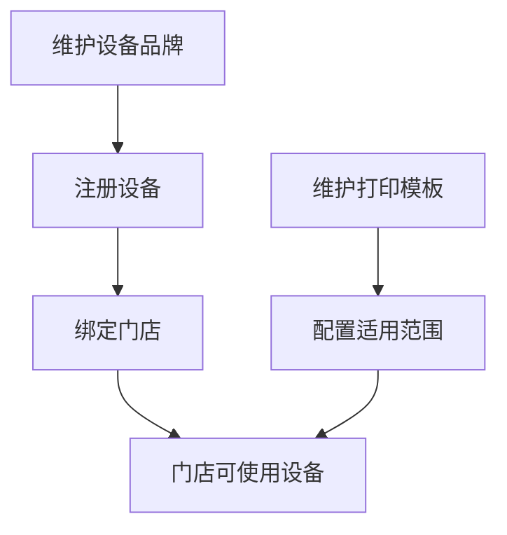
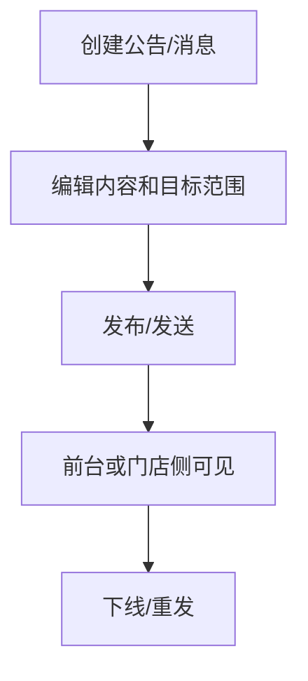
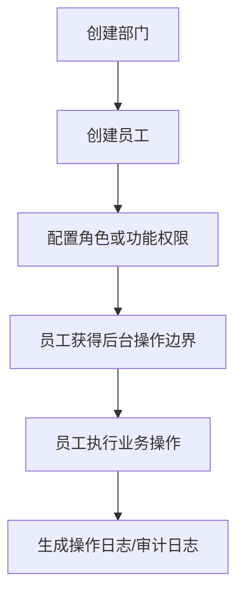
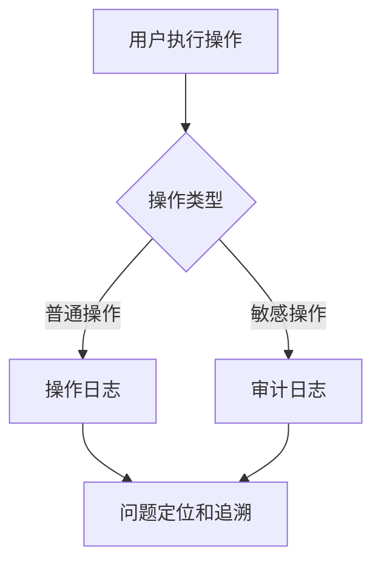

# SaaS 后台管理系统 PRD

版本：v0.1  
文档状态：前端原型需求稿  
适用范围：当前 `apps/web-ele` 中的 SaaS 管理后台原型

## 1. 背景

当前项目是一个面向文旅、票务、门店经营场景的 SaaS 平台后台原型。系统用于平台侧运营人员管理工作台业务、租户、门店、应用、版本、设备、公告、日志、消息和内部员工权限。

本 PRD 以当前前端原型为依据，明确页面职责、核心字段、交互动作、状态流转和验收标准，便于后续原型评审、视觉设计和研发拆分。

## 2. 产品目标

1. 建立一套清晰的 SaaS 平台后台信息架构。
2. 支持平台运营人员完成工作台业务、租户、门店、应用和授权的核心管理动作。
3. 将“平台应用”和“门店应用授权”拆清楚：
   - 应用管理：维护平台可售卖、可开通的应用资料。
   - 门店应用授权：归属于具体门店，在门店管理的授权管理中维护。
4. 支持设备、打印模板、公告、消息、日志、内部员工和功能权限的基础原型展示。
5. 当前阶段仅做前端原型，不要求接入真实后端、数据库、支付通道或真实权限服务。

## 3. 非目标

1. 不实现真实数据持久化。
2. 不实现真实支付、计费、对账、发票流程。
3. 不实现真实租户隔离和接口级权限校验。
4. 不实现真实消息推送、短信、邮件或公众号触达。
5. 不实现真实设备在线状态、硬件通信和打印服务。

## 4. 目标用户

| 角色 | 使用目标 | 关注点 |
| --- | --- | --- |
| SaaS 平台超级管理员 | 管理所有租户、门店、应用和平台资源 | 全量数据、权限、审计、状态变更 |
| SaaS 运营人员 | 处理租户开户、门店授权、公告和消息 | 操作效率、状态清晰、流程完整 |
| SaaS 客服人员 | 查询门店、设备、日志和授权状态 | 快速定位问题、可追溯 |
| SaaS 产品/配置人员 | 配置应用、版本、功能边界和模板 | 字段完整、上下架逻辑清晰 |
| SaaS 内部管理员 | 管理员工、部门和功能权限 | 账号状态、权限边界、组织归属 |

## 5. 术语说明

| 术语 | 说明 |
| --- | --- |
| 租户 | SaaS 平台客户主体，通常对应企业、集团或文旅公司。 |
| 门店 | 租户下的经营单元，如景区门店、零售门店、餐饮门店、PMS 等。 |
| 应用 | 平台提供的可售卖、可开通能力，如会员营销中心、经营分析看板。 |
| 门店版本 | 门店基础能力包，用于定义不同门店类型下的基础功能边界。 |
| 门店应用授权 | 某个门店已开通的应用使用权，包含有效期、状态和价格信息。 |
| 工作台 | 原“首页”模块，承载门票产品、零售产品和订单处理入口。 |
| 门票产品 | 面向景区或场馆售卖的票类商品。 |
| 零售产品 | 面向门店售卖的实体或券类零售商品。 |
| 订单 | 用户购买门票、计时票、套票、年卡等产品后形成的交易记录。 |
| 门店选择 | 用户登录后选择本次要进入的集团或门店上下文。 |
| 上架 | 应用允许新企业查看并开通。 |
| 下架 | 应用关闭新开通入口，但不影响已开通企业继续使用。 |
| 停用 | 应用对所有企业不可见、不可开通、不可使用。 |
| 启用 | 将已停用应用恢复为已上架状态。 |

## 6. 信息架构

当前 SaaS 管理后台包含以下一级和二级模块：

| 一级模块 | 二级模块 | 页面职责 |
| --- | --- | --- |
| 登录后中转页 | 门店选择 | 登录后选择某一个集团或门店，再进入工作台工作概览。 |
| 工作台 | 门票产品管理 | 管理门票产品、票种、价格、有效期和销售状态。 |
| 工作台 | 零售产品管理 | 管理零售商品、分类、价格、库存和销售状态。 |
| 工作台 | 订单管理 / 门票订单 | 查询门票订单、支付状态、核销状态和退款状态。 |
| 工作台 | 订单管理 / 计时票订单 | 查询按时长计费的门票订单和核销状态。 |
| 工作台 | 订单管理 / 套票订单 | 查询套票订单、套票内容和履约状态。 |
| 工作台 | 订单管理 / 年卡订单 | 查询年卡购买订单、持卡人和有效期。 |
| 销售渠道 | 旅行社管理 | 管理旅行社渠道资料、负责人和结算合作状态。 |
| 销售渠道 | OTA管理 | 管理 OTA 渠道对接方式、返佣规则和合作状态。 |
| 销售渠道 | 人人分销 | 管理分销主体、联系人和佣金规则。 |
| 销售渠道 | 小程序 | 管理小程序售卖渠道、负责人和支付配置状态。 |
| 客户管理 | 游客列表 | 查看游客基本信息、来源渠道和最近消费情况。 |
| 客户管理 | 会员管理 / 会员设置页面 | 维护会员等级、升级条件和适用范围。 |
| 客户管理 | 会员管理 / 储值设置 | 维护会员储值方案、充值门槛和赠送规则。 |
| 客户管理 | 会员管理 / 积分管理 | 维护会员积分获取、消耗和适用场景。 |
| 客户管理 | 会员管理 / 礼包管理 | 维护会员礼包内容、领取条件和适用范围。 |
| 财务中心 | 我的账户 | 查看账户余额、冻结金额和累计收入概况。 |
| 财务中心 | 资金统计 | 查看收入、支出、提现和分账统计结果。 |
| 财务中心 | 资金日志 | 查看资金流水明细和处理状态。 |
| 财务中心 | 分账规则 | 维护不同销售渠道的分账对象和分账比例。 |
| 财务中心 | 电子发票 | 查看电子发票申请、开票金额和开票状态。 |
| 统计 | 数据中心 / 总览 | 查看核心经营指标总览。 |
| 统计 | 数据中心 / 景区 | 查看景区业务的订单量、客流和销售数据。 |
| 统计 | 数据中心 / 餐饮 | 查看餐饮业务的销售额、客单价和订单量。 |
| 统计 | 数据中心 / 零售 | 查看零售业务的销量、库存周转和销售数据。 |
| 统计 | 数据中心 / 住宿 | 查看住宿业务的入住率、房晚和销售额。 |
| 统计 | 报表中心 / 我的收藏 | 查看已收藏报表和常用报表入口。 |
| 统计 | 报表中心 / 经营报表 | 查看经营分析类报表和更新状态。 |
| 统计 | 报表中心 / 门票 | 查看门票业务报表和数据更新状态。 |
| 统计 | 报表中心 / 餐饮 | 查看餐饮业务报表和数据更新状态。 |
| 统计 | 报表中心 / 零售 | 查看零售业务报表和库存周转相关数据。 |
| 统计 | 报表中心 / 套票 | 查看套票业务报表和套票组合销售表现。 |
| 应用中心 | 应用首页 | 查看我的应用、支付账户余额、版本升级和推荐应用。 |
| 应用中心 | 商品列表 | 按分类搜索和查看票务经营应用。 |
| 应用中心 | 应用管理 | 查看使用中、已过期和全部应用。 |
| 应用中心 | 我的订单 | 查询应用购买、开通和续费订单。 |
| 设置 | 门店设置 | 维护当前门店的基础资料、联系方式、地址、营业时间和营业状态。 |
| 设置 | 门店管理 | 集团查看下属门店列表，并维护资金入账方、服务费承担方和会员体系归属。 |
| 设置 | 账号管理 | 管理账号授权角色、门店和部门，支持批量调整。 |
| 设置 | 角色管理 | 维护账号权限组。 |
| 设置 | 部门管理 | 维护账号部门结构。 |
| SaaS管理 | 客户管理 / 租户管理 | 管理租户和顶级管理员。 |
| SaaS管理 | 客户管理 / 门店管理 | 管理门店基础信息、版本、授权管理、应用授权、授权记录、支付配置和状态。 |
| SaaS管理 | SaaS产品管理 / 应用管理 | 管理平台应用资料、价格、入口、权限字段和应用状态。 |
| SaaS管理 | SaaS产品管理 / 资源管理 | 管理按量付费资源的麦点计费方式和麦点资源包售价。 |
| SaaS管理 | SaaS产品管理 / 门店版本管理 | 管理不同门店类型下的版本能力包。 |
| SaaS管理 | 平台资源管理 / 设备列表 | 管理设备注册、编辑、绑定、解绑，并在搜索栏按钮区维护设备品牌。 |
| SaaS管理 | 平台资源管理 / 打印模板管理 | 管理打印模板、适用范围、预览和状态。 |
| SaaS管理 | 公告管理 / 顶部公告 | 管理顶部公告的创建、编辑、启用和停用。 |
| SaaS管理 | 公告管理 / 新闻资讯 | 管理资讯内容的创建、编辑、发布和下线。 |
| SaaS管理 | 公告管理 / 功能上新 | 管理功能上新通知和目标版本。 |
| SaaS管理 | 公告管理 / 弹窗公告 | 管理弹窗公告的生效、替换和下线。 |
| SaaS管理 | 平台通用能力 / 操作日志 | 查询平台操作留痕。 |
| SaaS管理 | 平台通用能力 / 审计日志 | 查询敏感操作和关键变更记录。 |
| SaaS管理 | 平台通用能力 / 消息通知 | 创建通知、查看触达状态、重新发送。 |
| SaaS管理 | SaaS用户管理 / 员工账号管理 | 管理平台内部员工账号、角色、权限和状态。 |
| SaaS管理 | SaaS用户管理 / 功能权限管理 | 管理角色或职能的功能级权限。 |
| SaaS管理 | SaaS用户管理 / 部门管理 | 管理组织部门、负责人和启停状态。 |

说明：独立的“门店权益管理”已从 SaaS 产品管理中移除，其能力并入“客户管理 / 门店管理 / 授权管理 / 门店应用授权”。

## 7. 核心业务流程

### 7.1 登录后门店选择流程

1. 用户登录成功后，不直接进入工作台。
2. 系统进入“门店选择”页面。
3. 页面基于 `SaaS管理 / 客户管理 / 门店管理` 的门店数据，展示当前账号、门店类型筛选、门店搜索、创建门店入口和可进入门店卡片。
4. 用户点击某一个集团或门店卡片。
5. 系统记录本次会话的当前门店上下文。
6. 系统进入“工作台 / 工作概览”页面。
7. 用户点击“创建门店”时，系统进入创建门店流程。
8. 创建门店流程依次选择门店类型、选择门店版本、录入门店信息。
9. 创建完成后，新门店进入门店选择列表。

### 7.2 工作台业务处理流程

1. 运营人员进入“工作台”。
2. 在“门票产品管理”维护门票产品、票种、销售价、有效期和销售状态。
3. 在“零售产品管理”维护零售产品、分类、销售价、库存和销售状态。
4. 在“订单管理”下按订单类型查看交易记录：
   - 门票订单。
   - 计时票订单。
   - 套票订单。
   - 年卡订单。
5. 订单列表支持按关键字和订单状态筛选，用于快速定位订单处理情况。

### 7.3 租户开户流程

1. 平台运营人员进入“租户管理”。
2. 点击“新建租户”。
3. 填写租户名称、管理员手机号、用户名、初始密码等信息。
4. 系统生成租户记录和顶级管理员账号。
5. 后续可进入维护抽屉查看租户、重置密码、停用或启用租户。

### 7.4 门店创建和授权流程

1. 平台运营人员进入“门店管理”。
2. 点击“新建门店”。
3. 填写所属租户、门店类型、门店名称、地址、管理员手机号、用户名和初始密码。
4. 门店创建后默认分配基础版，并生成默认授权到期日。
5. 进入列表操作“授权管理”。
6. 在授权管理中完成：
   - 查看授权版本和授权到期日。
   - 切换门店版本。
   - 查看版本基础功能。
   - 开通、续期或关闭门店应用授权。
   - 延期门店整体授权。

### 7.5 应用生命周期流程

1. 平台产品人员进入“应用管理”。
2. 新增应用，维护应用 ID、图标、名称、介绍、价格、落地页地址、应用地址、权限接口字段和可见范围。
3. 根据业务需要执行上架、下架、停用、启用。
4. 门店授权时引用应用管理中的应用信息，形成门店应用授权。

### 7.6 门店应用授权流程

1. 运营人员进入“门店管理”。
2. 点击目标门店的“授权管理”。
3. 在“门店应用授权”区域点击“开通应用”。
4. 选择授权应用和授权时间。
5. 保存后该门店获得指定应用的使用权。
6. 后续可对授权记录执行“续期”或“关闭”。

### 7.7 集团下属门店配置维护流程

1. 集团管理员进入“设置 / 门店管理”。
2. 页面直接展示当前集团下属门店列表。
3. 管理员可按门店 ID、名称、管理员电话、门店类型、门店分组、资金入账方、服务费承担方或会员体系归属筛选。
4. 点击目标门店的“维护”。
5. 在维护侧边抽屉中调整资金入账方、服务费承担方和会员体系归属。
6. 保存后列表即时刷新本地状态，用于原型演示配置变更结果。

### 7.8 公告发布流程

1. 运营人员进入对应公告页面。
2. 新建公告、资讯、功能上新或弹窗公告。
3. 维护标题、内容、目标范围和时间。
4. 执行发布或下线。
5. 页面更新状态，便于演示生命周期。

## 8. 业务流转逻辑

本章节描述 SaaS 后台中各业务对象之间的先后关系、依赖关系和状态影响。当前阶段为前端原型，以下流转用于指导页面组织、演示路径和交互一致性。

### 8.1 总体业务主链路

主链路说明：

1. 租户是客户主体，门店必须归属于租户。
2. 门店创建后需要有门店版本，版本决定基础能力边界。
3. 应用由平台统一维护，门店通过应用授权获得具体应用使用权。
4. 支付配置、设备绑定、打印模板属于门店运营支撑能力。
5. 公告、消息、日志、审计贯穿整个运营过程。

### 8.2 租户到门店流转

业务规则：

1. 新建门店必须选择所属租户。
2. 租户停用后，该租户下门店原则上不应继续新增业务配置。
3. 门店停用后，门店业务能力暂停，但历史配置保留。
4. 门店过期后，可通过延期恢复启用。
5. 门店创建后默认进入启用状态，并分配默认版本。

### 8.3 应用到门店授权流转

应用状态规则：

| 应用状态 | 是否可被新门店开通 | 已开通门店是否可继续使用 | 是否在应用入口展示 |
| --- | --- | --- | --- |
| 已上架 | 是 | 是 | 是 |
| 已下架 | 否 | 是 | 管理侧可见，业务侧不展示新开通入口 |
| 已停用 | 否 | 否 | 否 |

门店应用授权规则：

1. 门店只能开通状态为“已上架”的应用。
2. 同一门店同一应用在“生效中”状态下不允许重复开通。
3. 授权到期后状态变为“已到期”，可通过续期恢复为“生效中”。
4. 授权关闭后状态变为“已关闭”，门店不可继续使用该应用。
5. 应用被停用后，应影响所有门店的可见、开通和使用能力；原型中通过应用状态体现该影响。

### 8.4 应用状态流转

按钮展示规则：

| 当前状态 | 可展示动作 | 不展示动作 |
| --- | --- | --- |
| 已上架 | 下架、停用 | 上架、启用 |
| 已下架 | 上架、停用 | 下架、启用 |
| 已停用 | 启用 | 上架、下架、停用 |

动作影响：

| 动作 | 影响范围 |
| --- | --- |
| 上架 | 恢复应用新开通入口，符合可见范围的门店可开通。 |
| 下架 | 关闭新开通入口，不影响已开通门店继续使用。 |
| 停用 | 全部企业不可查看、不可开通、不可使用该应用。 |
| 启用 | 将已停用应用恢复为已上架状态。 |

### 8.5 门店版本与应用授权关系

业务规则：

1. 门店版本定义基础能力边界，例如基础版、专业版、旗舰版。
2. 门店应用授权定义额外开通的应用能力。
3. 切换版本会影响版本基础功能，但不应自动删除门店应用授权。
4. 门店应用授权是否可用，需要同时满足：门店状态为启用、门店整体授权未过期、应用状态不是已停用、门店应用授权状态为生效中。

### 8.6 门店支付配置流转

业务规则：

1. 支付配置归属于门店。
2. 一个门店可以维护支付通道、终端号、小程序、公众号等信息。
3. 费率配置用于展示借记卡、微信、支付宝、银联二维码和提现手续费等配置项。
4. 当前原型只模拟保存，不校验真实商户号和密钥。

### 8.7 设备与打印模板流转

业务规则：

1. 设备品牌先于设备注册存在。
2. 设备可以绑定到门店，也可以解绑。
3. 打印模板按模板类型和适用范围维护。
4. 门店实际可用打印能力由设备绑定和模板适用范围共同决定。

### 8.8 公告与消息触达流转

业务规则：

1. 顶部公告遵循创建、编辑、启用、停用的生命周期。
2. 新闻资讯和功能上新遵循创建、编辑、发布、下线、重新发布的生命周期。
3. 弹窗公告遵循创建、编辑、设为生效、下线、重新生效的生命周期。
4. 消息通知遵循创建、发送、失败重发、查看详情的流程。
5. 当前原型重点展示内容状态，不实现真实触达通道。

### 8.9 内部员工与权限流转

业务规则：

1. 员工账号应归属到部门。
2. 员工可通过角色或功能权限获得页面与按钮操作范围。
3. 权限配置用于原型展示功能边界，不在当前阶段实现真实接口鉴权。
4. 敏感操作应进入审计日志，普通操作进入操作日志。

### 8.10 日志与审计沉淀流转

业务规则：

1. 新建、编辑、启停、上下架、授权、关闭等动作应形成操作留痕。
2. 密码重置、权限配置、停用应用、关闭授权等高风险动作应形成审计记录。
3. 当前原型以日志页面样例数据展示，不实现真实日志采集。

### 8.11 端到端演示脚本

建议评审时使用以下演示路径：

1. 进入租户管理，新建一个租户。
2. 进入门店管理，为该租户新建门店。
3. 进入应用管理，查看应用上下架、停用、启用状态规则。
4. 回到门店管理，进入该门店的授权管理。
5. 切换门店版本，查看版本基础功能变化。
6. 在门店应用授权中开通一个应用。
7. 对该应用授权执行续期和关闭。
8. 进入支付配置，展示通道和费率配置。
9. 进入设备列表和打印模板，展示门店运营资源。
10. 发布公告或消息，展示平台触达能力。
11. 进入操作日志和审计日志，展示操作追溯能力。

## 9. 功能需求

## 9.1 工作台

### 9.1.1 门店选择

页面目标：用户登录后先选择当前要进入的集团或门店，再进入工作台工作概览。

页面字段：

| 字段 | 说明 |
| --- | --- |
| 当前账号 | 展示当前登录手机号。 |
| 门店类型 | 从 `SaaS管理 / 客户管理 / 门店管理` 的门店类型派生，包含全部、集团门店、景区门店、零售门店、餐饮门店、PMS 等。 |
| 搜索名称 | 按门店名称、门店编号、所属租户、门店类型或管理员手机号筛选。 |
| 门店卡片 | 展示门店类型、门店名称、版本标签和授权有效期。卡片不展示图标，使用圆角样式。 |

核心动作：

| 动作 | 说明 |
| --- | --- |
| 切换类型 | 按门店类型过滤卡片。 |
| 搜索 | 按名称过滤门店卡片。 |
| 创建门店 | 进入创建门店三步流程：选择门店类型、选择门店版本、输入门店信息。 |
| 选择门店 | 记录当前门店上下文，并进入工作台 / 工作概览。 |

创建门店流程：

| 步骤 | 页面要求 |
| --- | --- |
| 选择门店类型 | 卡片展示 PMS、营销系统、集团版，包含类型名称、说明和必要提示。 |
| 选择门店版本 | 卡片展示基础版、专业版、商务版，包含版本说明、价格、核心功能和适用场景。 |
| 输入门店信息 | 表单展示所选门店类型和版本，录入门店名称、门店类型、门店地址、详细地址、联系人和邀请码。 |

工作台为原“首页”模块，作为门店经营业务入口，包含产品管理和订单管理。

### 9.1.2 门票产品管理

页面目标：维护门票产品、票种、价格、有效期和销售状态。

核心字段：

| 字段 | 说明 |
| --- | --- |
| 产品 ID | 门票产品唯一标识。 |
| 产品名称 | 门票产品展示名称。 |
| 票种 | 普通门票、夜场票、优惠票等票类。 |
| 销售价 | 门票销售价格。 |
| 有效期 | 门票可使用时间范围或规则。 |
| 状态 | 销售中、待上架、已下架。 |
| 更新时间 | 最近维护时间。 |

核心动作：新增门票产品、查询、重置。

### 9.1.3 零售产品管理

页面目标：维护门店零售商品、价格、库存和销售状态。

核心字段：

| 字段 | 说明 |
| --- | --- |
| 产品 ID | 零售产品唯一标识。 |
| 产品名称 | 零售产品展示名称。 |
| 零售分类 | 文创周边、饮品等分类。 |
| 销售价 | 零售产品销售价格。 |
| 库存 | 当前可售库存。 |
| 状态 | 销售中、待上架、已下架。 |
| 更新时间 | 最近维护时间。 |

核心动作：新增零售产品、查询、重置。

### 9.1.4 订单管理

订单管理为工作台下的订单查询分组，包含门票订单、计时票订单、套票订单和年卡订单。

| 子页面 | 页面目标 | 关键字段 |
| --- | --- | --- |
| 门票订单 | 查询门票订单、支付状态、核销状态和退款状态 | 订单号、门票产品、游客、数量、订单金额、订单状态、下单时间 |
| 计时票订单 | 查询按时长计费的门票订单和核销状态 | 订单号、计时票产品、游客、计时时长、订单金额、订单状态、下单时间 |
| 套票订单 | 查询套票订单、套票内容和履约状态 | 订单号、套票产品、游客、套票内容、订单金额、订单状态、下单时间 |
| 年卡订单 | 查询年卡购买订单、持卡人和有效期 | 订单号、年卡名称、持卡人、有效期、订单金额、订单状态、下单时间 |

订单状态：待支付、已支付、已核销、已退款。

核心动作：导出订单、查询、重置。

## 9.2 销售渠道

页面目标：统一管理旅行社、OTA、人人分销和小程序等销售渠道档案、合作状态和基础结算规则。

| 页面 | 页面目标 | 核心字段 |
| --- | --- | --- |
| 旅行社管理 | 管理旅行社渠道资料、负责人和结算合作状态 | 渠道ID、旅行社名称、负责人、结算方式、状态、更新时间 |
| OTA管理 | 管理 OTA 渠道对接方式、返佣规则和合作状态 | 渠道ID、OTA名称、对接方式、返佣规则、状态、更新时间 |
| 人人分销 | 管理分销主体、联系人和佣金规则 | 分销ID、分销主体、联系人、佣金规则、状态、更新时间 |
| 小程序 | 管理小程序售卖渠道、负责人和支付配置状态 | 渠道ID、小程序名称、负责人、支付配置、状态、更新时间 |

状态说明：合作中、待开通、已停用。  
核心动作：新增渠道、查询、重置。

## 9.3 客户管理

说明：本模块为经营侧客户中心，与 `SaaS管理 / 客户管理` 中的租户与门店管理不同。

### 9.3.1 游客列表

页面目标：查看游客基本信息、来源渠道和最近消费情况。

核心字段：游客ID、游客姓名、手机号、来源渠道、最近消费、状态。  
核心动作：导出游客列表、查询、重置。

### 9.3.2 会员管理

页面目标：统一维护会员规则、储值、积分和礼包配置。

| 子页面 | 页面目标 | 核心字段 |
| --- | --- | --- |
| 会员设置页面 | 维护会员等级、升级条件和适用范围 | 规则名称、会员等级、当前配置、适用范围、状态、更新时间 |
| 储值设置 | 维护会员储值方案、充值门槛和赠送规则 | 方案名称、充值规则、赠送规则、适用范围、状态、更新时间 |
| 积分管理 | 维护会员积分获取、消耗和适用场景 | 规则名称、获取场景、使用场景、适用范围、状态、更新时间 |
| 礼包管理 | 维护会员礼包内容、领取条件和适用范围 | 礼包名称、礼包内容、领取条件、适用范围、状态、更新时间 |

状态说明：启用、草稿、停用。  
核心动作：新增规则、查询、重置。

## 9.4 财务中心

页面目标：查看账户、资金流转、分账规则和电子发票状态。

| 页面 | 页面目标 | 核心字段 |
| --- | --- | --- |
| 我的账户 | 查看账户余额、冻结金额和累计收入概况 | 账户类型、可用余额、冻结金额、累计收入、状态、更新时间 |
| 资金统计 | 查看收入、支出、提现和分账统计结果 | 统计日期、收入、支出、提现、分账金额、状态 |
| 资金日志 | 查看资金流水明细和处理状态 | 日志ID、业务类型、金额、收支方向、状态、发生时间 |
| 分账规则 | 维护不同销售渠道的分账对象和分账比例 | 规则名称、适用渠道、分账对象、分账比例、状态、更新时间 |
| 电子发票 | 查看电子发票申请、开票金额和开票状态 | 发票号、抬头、金额、发票类型、状态、开票时间 |

状态说明：正常、处理中、已关闭。  
核心动作：查看明细、导出、查询、重置。

## 9.5 统计

### 9.5.1 数据中心

页面目标：从总览、景区、餐饮、零售、住宿五个维度查看核心经营指标。

| 子页面 | 页面目标 | 核心字段 |
| --- | --- | --- |
| 总览 | 查看核心经营指标总览 | 指标、当前值、环比、同比、状态、更新时间 |
| 景区 | 查看景区业务的订单量、客流和销售数据 | 景区指标、当前值、环比、同比、状态、更新时间 |
| 餐饮 | 查看餐饮业务的销售额、客单价和订单量 | 餐饮指标、当前值、环比、同比、状态、更新时间 |
| 零售 | 查看零售业务的销量、库存周转和销售数据 | 零售指标、当前值、环比、同比、状态、更新时间 |
| 住宿 | 查看住宿业务的入住率、房晚和销售额 | 住宿指标、当前值、环比、同比、状态、更新时间 |

### 9.5.2 报表中心

页面目标：集中查看常用报表收藏和经营分析报表。

| 子页面 | 页面目标 | 核心字段 |
| --- | --- | --- |
| 我的收藏 | 查看已收藏报表和常用报表入口 | 报表名称、报表类型、收藏人、统计周期、状态、更新时间 |
| 经营报表 | 查看经营分析类报表和更新状态 | 报表名称、统计维度、统计周期、负责人、状态、更新时间 |
| 门票 | 查看门票业务报表和数据更新状态 | 报表名称、统计维度、统计周期、负责人、状态、更新时间 |
| 餐饮 | 查看餐饮业务报表和数据更新状态 | 报表名称、统计维度、统计周期、负责人、状态、更新时间 |
| 零售 | 查看零售业务报表和库存周转相关数据 | 报表名称、统计维度、统计周期、负责人、状态、更新时间 |
| 套票 | 查看套票业务报表和套票组合销售表现 | 报表名称、统计维度、统计周期、负责人、状态、更新时间 |

状态说明：已发布、更新中、草稿。  
核心动作：导出、查询、重置、收藏常用报表。

## 9.6 应用中心

页面目标：为当前票务系统提供经营应用的查看、开通、续费和订单查询入口，不承担平台侧应用档案维护职责。

| 页面 | 页面目标 | 核心内容 |
| --- | --- | --- |
| 应用首页 | 汇总我的应用、账户余额、版本升级和推荐应用 | 我的应用、支付账户余额、版本升级、AI、渠道直连、多业态协同、更多功能、生态合作 |
| 商品列表 | 按分类检索可开通应用 | 应用名称、分类、标签、介绍、服务商、价格或开通动作 |
| 应用管理 | 查看不同使用状态的应用 | 使用中、已过期、全部应用、有效期、续费动作 |
| 我的订单 | 查询应用购买、开通和续费订单 | 订单编号、商品信息、商品类型、单价、数量、订单金额、实付金额、退款金额、订单状态、收件信息 |

应用分类：

| 分类 | 示例应用 | 说明 |
| --- | --- | --- |
| 版本升级 | 票务专业版、售票高峰加油包 | 扩展票务系统基础版本、容量和承载能力。 |
| AI | 智能客流预测、票务智能客服、活动内容助手 | 辅助客流预测、客服问答和营销内容生成。 |
| 渠道直连 | 美团门票直连、携程门票直连、抖音团购核销、旅行社分销助手 | 打通 OTA、团购和旅行社等售卖渠道。 |
| 多业态协同 | 套票组合营销、二消权益中心、年卡会员中心 | 联动门票、餐饮、零售、会员和年卡权益。 |
| 更多功能 | 票务核销助手、电子发票助手、景区经营看板 | 补充核销设备、财务发票和经营数据能力。 |
| 生态合作 | 智慧导览合作 | 对接导览、游线和生态伙伴服务。 |

核心规则：

1. 应用中心作为经营侧入口，与 `SaaS管理` 同级。
2. 页面内容围绕当前票务系统，不复刻外部截图里的酒店或 PMS 应用。
3. 页面不插入图片或图标，仅使用文字、标签、按钮、卡片和表格表达。
4. 应用中心的应用开通、续费和订单查询属于前端原型展示，不接入真实支付和授权服务。
5. 应用中心与 `SaaS管理 / SaaS产品管理 / 应用管理` 职责不同：前者面向经营侧开通使用，后者面向平台侧维护应用档案和生命周期。

## 9.7 SaaS管理 / 客户管理

### 9.7.1 租户管理

页面目标：查看与筛选租户，并完成租户生命周期内的关键管理动作。

核心字段：

| 字段 | 说明 |
| --- | --- |
| 租户名称 | 客户主体名称。 |
| 管理员账号 | 租户顶级管理员账号。 |
| 管理员手机号 | 管理员联系方式。 |
| 门店数量 | 租户下门店数量。 |
| 租户状态 | 启用或停用。 |
| 创建时间 | 租户创建时间。 |
| 最近登录时间 | 管理员最近登录时间。 |

核心动作：

| 动作 | 说明 |
| --- | --- |
| 新建租户 | 创建租户和顶级管理员。 |
| 维护 | 查看租户信息、重置管理员密码、启用或停用租户。 |

状态流转：

| 当前状态 | 动作 | 目标状态 | 说明 |
| --- | --- | --- | --- |
| 启用 | 停用 | 停用 | 停用后租户不可继续使用。 |
| 停用 | 启用 | 启用 | 启用后租户恢复使用。 |

### 9.7.2 门店管理

页面目标：查看与筛选门店，并完成门店生命周期、版本、应用授权、支付配置等核心动作。

核心字段：

| 字段 | 说明 |
| --- | --- |
| 门店编号 | 门店唯一编号。 |
| 门店名称 | 门店展示名称。 |
| 门店类型 | 集团门店、景区门店、零售门店、餐饮门店或 PMS。 |
| 门店版本 | 基础版、专业版、旗舰版。 |
| 门店状态 | 启用、停用、过期。 |
| 授权到期 | 门店整体授权到期日。 |
| 管理员账号 | 门店管理员账号。 |
| 管理员手机号 | 门店管理员手机号。 |
| 所属租户 | 门店所属客户主体。 |
| 支付费率 | 门店当前支付费率。 |

核心动作：

| 动作 | 说明 |
| --- | --- |
| 新建门店 | 创建门店并初始化管理员账号。 |
| 基础信息 | 查看门店资料、处理启用或停用。 |
| 授权管理 | 查看版本能力、门店应用授权、授权到期和授权记录。 |
| 支付配置 | 维护支付通道和费率。 |
| 延期 | 延长门店整体授权到期日。 |

授权管理区域应包含：

| 区域 | 说明 |
| --- | --- |
| 授权版本 | 展示当前版本和整体授权到期日。 |
| 切换版本 | 切换基础版、专业版或旗舰版。 |
| 授权延期 | 延长门店整体授权到期日。 |
| 版本基础功能 | 展示当前版本包含的基础功能。 |
| 门店应用授权 | 展示该门店已开通应用，并支持开通、续期、关闭。 |
| 授权记录 | 以授权管理子页面展示该客户的授权续费、权益购买和应用开通记录。 |

门店应用授权字段：

| 字段 | 说明 |
| --- | --- |
| 应用 ID | 被授权应用的业务标识。 |
| 应用名称 | 被授权应用名称。 |
| 价格 | 应用价格或计费方式。 |
| 开始时间 | 授权开始日期。 |
| 到期时间 | 授权结束日期。 |
| 状态 | 生效中、已到期、已关闭。 |

门店应用授权动作：

| 动作 | 说明 |
| --- | --- |
| 开通应用 | 给当前门店开通指定应用。 |
| 续期 | 延长当前应用授权有效期。 |
| 关闭 | 关闭当前门店的应用授权。 |

授权记录字段：

| 字段 | 说明 |
| --- | --- |
| 记录类型 | 授权续费、权益购买、应用开通。 |
| 关联项目 | 续费版本、权益包或开通应用名称。 |
| 金额 | 本次消费或计费方式。 |
| 发生时间 | 授权记录创建时间。 |
| 操作人 | 产生该记录的操作人。 |
| 说明 | 记录备注。 |

门店状态流转：

| 当前状态 | 动作 | 目标状态 | 说明 |
| --- | --- | --- | --- |
| 启用 | 停用 | 停用 | 门店业务能力暂停。 |
| 停用 | 启用 | 启用 | 门店恢复业务能力。 |
| 启用 | 授权到期 | 过期 | 整体授权到期后进入过期状态。 |
| 过期 | 延期 | 启用 | 延期成功后恢复启用。 |

## 9.8 SaaS管理 / SaaS产品管理

### 9.8.1 应用管理

页面目标：管理平台应用档案、价格、入口、权限字段和应用状态。

核心字段：

| 字段 | 说明 |
| --- | --- |
| 应用 ID | 应用唯一业务标识。 |
| 应用图标 | 应用列表和入口展示图标。 |
| 应用名称 | 应用展示名称。 |
| 应用类型 | 营销应用、运营应用、数据应用。 |
| 应用介绍 | 应用能力、适用场景和核心价值。 |
| 应用价格 | 售卖价格或计费方式。 |
| 落地页地址 | 应用介绍页或营销页地址。 |
| 应用地址 | 应用实际访问入口地址。 |
| 应用权限接口字段维护 | 应用权限码、接口标识或字段映射。 |
| 可见范围 | 哪些版本或门店类型可看到该应用。 |
| 应用状态 | 已上架、已下架、已停用。 |

核心动作：

| 动作 | 展示条件 | 说明 |
| --- | --- | --- |
| 新增应用 | 页面顶部 | 新增平台应用档案。 |
| 编辑 | 所有状态 | 修改应用资料、价格、入口、权限字段和状态。 |
| 上架 | 已下架 | 恢复新企业开通入口。 |
| 下架 | 已上架 | 关闭新企业开通入口，不影响已开通企业使用。 |
| 启用 | 已停用 | 恢复为已上架状态，允许查看、开通和使用。 |
| 停用 | 已上架或已下架 | 所有企业不可查看、不可开通、不可使用。 |

按钮互斥规则：

| 应用状态 | 可见状态动作 |
| --- | --- |
| 已上架 | 下架、停用 |
| 已下架 | 上架、停用 |
| 已停用 | 启用 |

状态流转：

| 当前状态 | 动作 | 目标状态 | 说明 |
| --- | --- | --- | --- |
| 已上架 | 下架 | 已下架 | 关闭新企业开通入口。 |
| 已下架 | 上架 | 已上架 | 恢复新企业开通入口。 |
| 已上架或已下架 | 停用 | 已停用 | 全部企业不可查看、不可开通、不可使用。 |
| 已停用 | 启用 | 已上架 | 恢复展示、开通和使用能力。 |

### 9.8.2 资源管理

页面目标：管理按量付费资源的麦点计费方式，并维护麦点资源包售价。

页面边界：

1. 资源管理类似应用管理，展示所有可按量付费的应用或能力。
2. 资源管理销售的是按量资源，不按时间周期售卖。
3. 资源管理采用“麦点”计费，麦点可理解为平台积分。
4. 应用管理维护应用档案、上下架和时间型售卖信息；资源管理维护短信、AI营销、AI文案等按量能力的扣点规则。

列表字段：

| 字段 | 说明 |
| --- | --- |
| 名称 | 按量付费资源名称，例如短信通知、AI营销、AI文案、智能客流预测、电子发票等。 |
| 计费方式 | 该资源按使用量扣减麦点的规则，例如每条短信扣 1 麦点。 |
| 更新时间 | 最近一次维护计费方式的时间。 |

核心动作：

| 动作 | 说明 |
| --- | --- |
| 搜索 | 按资源名称、计费方式或使用场景筛选资源。 |
| 维护 | 设置指定应用或能力的计费单位和扣减麦点数。 |
| 新增麦点资源包 | 在搜索栏按钮区新增麦点资源包套餐。 |
| 删除麦点资源包 | 删除不再展示的麦点资源包套餐。 |

麦点资源包要求：

| 套餐示例 | 说明 |
| --- | --- |
| 100 元 1000 麦点 | 基础麦点资源包。 |
| 1000 元 11000 麦点 | 大额麦点资源包，允许配置赠送麦点。 |

计费规则示例：

| 资源 | 计费方式 |
| --- | --- |
| 短信通知 | 每条短信扣 1 麦点。 |
| AI营销 | 每次营销生成扣 20 麦点。 |
| AI文案 | 每篇文案扣 5 麦点。 |
| 智能客流预测 | 每次预测扣 30 麦点。 |

### 9.8.3 门店版本管理

页面目标：维护门店版本配置，并确保版本能力边界清晰、状态准确。

核心字段：

| 字段 | 说明 |
| --- | --- |
| 版本名称 | 基础版、专业版、旗舰版等。 |
| 门店类型 | 版本适用的门店类型。 |
| 功能范围 | 版本包含的功能边界。 |
| 版本状态 | 启用或停用。 |
| 版本说明 | 适用场景和能力描述。 |

核心动作：

| 动作 | 说明 |
| --- | --- |
| 新建版本 | 为指定门店类型创建版本能力包。 |
| 维护 | 查看并编辑版本说明、功能边界和状态。 |
| 功能授权 | 弹出功能授权弹窗，以穿梭框维护该版本可使用的系统页面权限。 |
| 停用 | 启用状态下展示，点击后版本状态变为停用。 |
| 启用 | 停用状态下展示，点击后版本状态变为启用。 |

功能授权要求：

1. 权限菜单按照当前系统页面树构建，包含工作台、销售渠道、客户管理、财务中心、统计、设置和 SaaS 管理等菜单及其子页面。
2. 授权弹窗使用穿梭框展示，左侧为系统页面权限，右侧为该版本已授权权限。
3. 权限项需保留菜单层级关系，便于识别目录和页面。
4. 保存后，该门店版本的权限选择结果在当前原型状态中保留。

状态操作互斥：

| 当前状态 | 展示动作 | 点击后状态 |
| --- | --- | --- |
| 启用 | 停用 | 停用 |
| 停用 | 启用 | 启用 |

## 9.9 SaaS管理 / 平台资源管理

### 9.9.1 设备列表

页面目标：维护平台设备档案、门店绑定关系和设备品牌，确保设备可追踪、可分配，品牌可在设备列表内完成维护。

核心字段：

| 字段 | 说明 |
| --- | --- |
| 设备名称 | 设备展示名称。 |
| 设备编号 | 设备唯一编号。 |
| 设备品牌 | 所属设备品牌。 |
| 绑定门店 | 当前绑定门店。 |
| 绑定状态 | 已绑定或未绑定。 |
| 更新时间 | 最近更新时间。 |

核心动作：注册设备、编辑、查看绑定、解绑、设备品牌。

设备品牌入口：

设备品牌不作为单独页面展示，入口放在设备列表搜索栏按钮区，点击后以侧边抽屉展示品牌维护内容。

设备品牌字段：品牌名称、品牌编码、品牌状态、设备数量、更新时间。  
设备品牌动作：新增品牌、编辑品牌、禁用品牌、启用品牌。启用状态只展示禁用动作，禁用状态只展示启用动作。

### 9.9.2 打印模板管理

页面目标：维护打印模板配置和适用范围，确保模板可预览、可管理、可追踪。

核心字段：模板名称、模板类型、适用范围、模板预览、状态、更新时间。  
核心动作：新建模板、编辑、查看、停用、启用。

## 9.10 SaaS管理 / 公告管理

公告管理用于维护平台内容触达能力，包括顶部公告、新闻资讯、功能上新和弹窗公告。

| 页面 | 目标 | 核心动作 |
| --- | --- | --- |
| 顶部公告 | 管理顶部公告的创建、展示和停用 | 新建、编辑、启用、停用 |
| 新闻资讯 | 管理资讯内容 | 新建、编辑、发布、下线 |
| 功能上新 | 管理功能上新通知和目标版本 | 新建、编辑、发布、下线 |
| 弹窗公告 | 管理弹窗公告的生效和替换 | 新建、编辑、设为生效、下线 |

顶部公告状态流转：

| 当前状态 | 动作 | 目标状态 |
| --- | --- | --- |
| 启用 | 停用 | 停用 |
| 停用 | 启用 | 启用 |

新闻资讯和功能上新状态流转：

| 当前状态 | 动作 | 目标状态 |
| --- | --- | --- |
| 草稿 | 发布 | 已发布 |
| 已发布 | 下线 | 已下线 |
| 已下线 | 发布 | 已发布 |

弹窗公告状态流转：

| 当前状态 | 动作 | 目标状态 |
| --- | --- | --- |
| 草稿 | 设为生效 | 生效中 |
| 生效中 | 下线 | 已下线 |
| 已下线 | 设为生效 | 生效中 |

公告操作按钮互斥规则：

| 页面 | 当前状态 | 可见状态动作 |
| --- | --- | --- |
| 顶部公告 | 启用 | 停用 |
| 顶部公告 | 停用 | 启用 |
| 新闻资讯 | 草稿、已下线 | 发布 |
| 新闻资讯 | 已发布 | 下线 |
| 功能上新 | 草稿、已下线 | 发布 |
| 功能上新 | 已发布 | 下线 |
| 弹窗公告 | 草稿、已下线 | 设为生效 |
| 弹窗公告 | 生效中 | 下线 |

## 9.11 SaaS管理 / 平台通用能力

### 9.11.1 操作日志

页面目标：查看平台操作留痕，支持问题定位和操作追溯。

核心字段：操作人、操作模块、操作对象、操作类型、操作时间、操作结果。  
核心动作：查看详情。

### 9.11.2 审计日志

页面目标：查看关键敏感操作的前后变更记录。

核心字段：审计对象、操作人、风险等级、变更前后、审计时间、审计说明。  
核心动作：查看详情。

### 9.11.3 消息通知

页面目标：管理通知创建、发送状态和重新发送。

核心字段：通知标题、通知对象、通知渠道、发送状态、发送时间。  
核心动作：创建通知、重新发送、查看详情。

## 9.12 SaaS管理 / SaaS用户管理

### 9.12.1 员工账号管理

页面目标：维护内部员工账号及其权限范围，确保员工账号状态和组织归属准确。

核心字段：员工姓名、手机号、所属部门、角色、账号状态、更新时间。  
核心动作：新建员工、编辑、权限配置、禁用、启用。

### 9.12.2 功能权限管理

页面目标：维护角色功能权限边界，确保各模块权限点配置清晰、可追踪。

核心字段：角色名称、适用部门、权限模块、权限点、更新时间。  
核心动作：新增权限配置、编辑权限、查看。

### 9.12.3 部门管理

页面目标：维护组织结构和部门归属信息，确保部门状态、负责人和层级准确。

核心字段：部门名称、上级部门、负责人、部门状态、员工数量、更新时间。  
核心动作：新增部门、编辑、禁用、启用。

## 9.13 设置

### 9.13.1 门店设置

页面目标：维护当前门店的基础资料、联系方式、地址、营业时间和营业状态。

页面边界：

1. 本页面面向当前登录门店自身资料维护。
2. 不用于管理集团下属门店列表。
3. 门店 ID 作为只读信息展示，不允许在原型中编辑。

核心字段：

| 字段 | 说明 |
| --- | --- |
| 门店 ID | 当前门店唯一标识，只读。 |
| 门店名称 | 当前门店完整名称。 |
| 门店简称 | 用于页面或票务场景中的短名称。 |
| 门店类型 | 直营网点、加盟门店或游客中心。 |
| 联系人 | 当前门店业务联系人。 |
| 管理员电话 | 当前门店管理员联系电话。 |
| 营业时间 | 当前门店营业时间段。 |
| 门店状态 | 营业中、筹备中、停用。 |
| 门店地址 | 当前门店经营地址。 |
| 门店介绍 | 当前门店业务说明或服务范围。 |

核心动作：

| 动作 | 说明 |
| --- | --- |
| 保存 | 保存当前门店资料修改，并在页面上即时刷新展示。 |
| 重置 | 恢复为最近一次保存后的门店资料。 |
| 查看说明 | 查看页面目标、边界和必填字段。 |

必填校验：门店名称、管理员电话、门店地址不能为空。

### 9.13.2 门店管理

页面目标：集团查看下属门店列表，并维护门店资金、服务费和会员体系归属配置。

页面边界：

1. 本页面面向集团管理下属门店，不用于平台侧创建门店。
2. 页面直接展示下属门店列表，不存在发起门店、关联门店或门店联营关系。
3. 维护动作仅调整资金入账方、服务费承担方和会员体系归属。
4. 添加门店用于将已有门店编号纳入当前集团下属门店列表，不承担平台侧新建门店职责。

核心字段：

| 字段 | 说明 |
| --- | --- |
| 门店 ID | 集团下属门店唯一标识。 |
| 门店名称 | 门店展示名称。 |
| 门店类型 | 直营网点、加盟门店或游客中心。 |
| 门店分组 | 门店在集团内的管理分组。 |
| 管理员电话 | 门店管理员联系电话。 |
| 门店地址 | 门店经营地址。 |
| 资金入账方 | 资金归集到集团或门店。 |
| 服务费承担方 | 服务费由集团或门店承担。 |
| 会员体系归属 | 会员体系归属于集团或门店。 |

筛选条件：

| 条件 | 说明 |
| --- | --- |
| 门店查询 | 支持按门店 ID、门店名称或管理员电话查询。 |
| 门店类型 | 按门店类型筛选。 |
| 门店分组 | 按集团内部分组筛选。 |
| 资金入账方 | 按集团或门店筛选。 |
| 服务费承担方 | 按集团或门店筛选。 |
| 会员体系归属 | 按集团或门店筛选。 |

核心动作：

| 动作 | 说明 |
| --- | --- |
| 查询 | 根据筛选条件刷新下属门店列表。 |
| 重置 | 清空筛选条件并恢复列表。 |
| 分组管理 | 打开侧边抽屉，维护集团门店分组。 |
| 添加门店 | 打开侧边抽屉，输入门店编号并设置分组、资金和会员归属。 |
| 维护 | 打开维护侧边抽屉，调整资金入账方、服务费承担方和会员体系归属。 |
| 移除门店 | 打开居中确认弹窗，确认后将门店移出当前集团门店列表。 |

分组管理：

| 动作 | 说明 |
| --- | --- |
| 新增分组 | 新增集团门店分组。 |
| 编辑分组 | 修改分组名称和说明。 |
| 删除分组 | 删除未被门店占用的分组。 |

添加门店字段：

| 字段 | 说明 |
| --- | --- |
| 门店编号 | 要添加到当前集团下的已有门店编号。 |
| 门店分组 | 添加后门店归属的集团分组。 |
| 资金入账方 | 资金归集到集团或门店。 |
| 服务费承担方 | 服务费由集团或门店承担。 |
| 会员体系归属 | 会员体系归属于集团或门店。 |

维护字段：

| 字段 | 可选值 | 说明 |
| --- | --- | --- |
| 资金入账方 | 集团、门店 | 控制门店交易资金归集主体。 |
| 服务费承担方 | 集团、门店 | 控制服务费由集团统一承担或门店承担。 |
| 会员体系归属 | 集团、门店 | 控制该门店会员体系归属到集团会员体系或门店自有会员体系。 |

### 9.13.3 账号管理

页面目标：维护当前集团或门店后台账号的授权角色、授权门店和所属部门。

核心字段：

| 字段 | 说明 |
| --- | --- |
| 姓名 | 后台账号使用人姓名。 |
| 登录账号 | 账号登录名。 |
| 手机号 | 账号绑定手机号。 |
| 授权角色 | 账号拥有的角色，可多选。 |
| 授权门店 | 账号可访问或操作的门店，可多选。 |
| 部门 | 账号所属部门，可多选。 |
| 状态 | 启用或停用。 |

核心动作：

| 动作 | 说明 |
| --- | --- |
| 查询 | 按姓名、登录账号或手机号搜索账号。 |
| 授权管理 | 打开侧边抽屉，维护单个账号的授权角色、授权门店和部门。 |
| 批量调整授权 | 勾选多个账号后，统一调整授权角色、授权门店和部门。 |

授权管理字段：

| 字段 | 说明 |
| --- | --- |
| 授权角色 | 支持选择一个或多个角色。 |
| 授权门店 | 支持选择一个或多个门店。 |
| 所属部门 | 支持选择一个或多个部门。 |

### 9.13.4 角色管理

页面目标：维护账号可选择的权限组。

核心字段：

| 字段 | 说明 |
| --- | --- |
| 角色名称 | 权限组名称。 |
| 角色说明 | 权限组适用范围或职责说明。 |
| 权限组 | 角色包含的功能权限集合，可多选。 |

核心动作：

| 动作 | 说明 |
| --- | --- |
| 新增角色 | 创建新的权限组。 |
| 编辑角色 | 修改角色名称、说明和权限组。 |
| 删除角色 | 删除不再使用的权限组。 |

### 9.13.5 部门管理

页面目标：维护账号所属部门结构。

核心字段：

| 字段 | 说明 |
| --- | --- |
| 部门名称 | 部门展示名称。 |
| 上级部门 | 当前部门所属的上级部门。 |
| 负责人 | 部门负责人。 |
| 状态 | 启用或停用。 |

核心动作：

| 动作 | 说明 |
| --- | --- |
| 新增部门 | 创建新的部门节点。 |
| 编辑部门 | 修改部门名称、上级部门、负责人和状态。 |
| 删除部门 | 删除未被子部门占用的部门。 |

## 10. 关键数据模型

### 10.1 门店选择项

| 字段 | 类型 | 说明 |
| --- | --- | --- |
| storeId | string | 门店或集团 ID。 |
| storeName | string | 门店或集团名称。 |
| storeType | enum | 集团、PMS、营销系统、SCRM。 |
| plan | string | 套餐或版本标签，如集团、基础。 |
| expireAt | date | 有效期截止日期。 |

### 10.2 工作台产品

| 字段 | 类型 | 说明 |
| --- | --- | --- |
| productId | string | 产品 ID。 |
| productName | string | 产品名称。 |
| productType | enum | 门票产品、零售产品。 |
| category | string | 票种或零售分类。 |
| salePrice | string | 销售价。 |
| stock | number | 零售产品库存，门票产品可为空。 |
| validity | string | 门票有效期，零售产品可为空。 |
| status | enum | 销售中、待上架、已下架。 |
| updatedAt | datetime | 更新时间。 |

### 10.3 工作台订单

| 字段 | 类型 | 说明 |
| --- | --- | --- |
| orderId | string | 订单号。 |
| orderType | enum | 门票订单、计时票订单、套票订单、年卡订单。 |
| productName | string | 订单关联产品名称。 |
| customerName | string | 游客、持卡人或购买人。 |
| quantity | number | 购买数量，部分订单类型可为空。 |
| duration | string | 计时票计时时长。 |
| packageItems | string | 套票包含内容。 |
| validity | string | 年卡有效期。 |
| amount | string | 订单金额。 |
| status | enum | 待支付、已支付、已核销、已退款。 |
| createdAt | datetime | 下单时间。 |

### 10.4 租户

| 字段 | 类型 | 说明 |
| --- | --- | --- |
| tenantId | string | 租户 ID。 |
| tenantName | string | 租户名称。 |
| username | string | 顶级管理员账号。 |
| phone | string | 管理员手机号。 |
| status | enum | 启用、停用。 |
| storeCount | number | 门店数量。 |
| createdAt | datetime | 创建时间。 |
| lastLoginAt | datetime | 最近登录时间。 |

### 10.5 门店

| 字段 | 类型 | 说明 |
| --- | --- | --- |
| storeId | string | 门店 ID。 |
| storeCode | string | 门店编号。 |
| storeName | string | 门店名称。 |
| storeType | enum | 集团门店、景区门店、零售门店、餐饮门店、PMS。 |
| tenantId | string | 所属租户 ID。 |
| version | string | 门店版本。 |
| status | enum | 启用、停用、过期。 |
| authorizationExpireAt | date | 整体授权到期日。 |
| managerUsername | string | 管理员账号。 |
| managerPhone | string | 管理员手机号。 |
| payRate | string | 支付费率。 |

### 10.6 应用

| 字段 | 类型 | 说明 |
| --- | --- | --- |
| appId | string | 应用 ID。 |
| appIcon | string | 应用图标。 |
| appName | string | 应用名称。 |
| appType | enum | 营销应用、运营应用、数据应用。 |
| appIntro | string | 应用介绍。 |
| price | string | 应用价格。 |
| landingPageUrl | string | 落地页地址。 |
| appUrl | string | 应用地址。 |
| permissionApiFields | string | 权限接口字段。 |
| visibility | string | 可见范围。 |
| status | enum | 已上架、已下架、已停用。 |

### 10.7 门店应用授权

| 字段 | 类型 | 说明 |
| --- | --- | --- |
| id | string | 授权记录 ID。 |
| storeId | string | 门店 ID。 |
| appId | string | 应用 ID。 |
| appName | string | 应用名称。 |
| price | string | 应用价格。 |
| startAt | date | 授权开始日期。 |
| endAt | date | 授权结束日期。 |
| status | enum | 生效中、已到期、已关闭。 |

### 10.8 集团下属门店

| 字段 | 类型 | 说明 |
| --- | --- | --- |
| storeId | string | 门店 ID。 |
| storeName | string | 门店名称。 |
| storeType | enum | 直营网点、加盟门店、游客中心。 |
| shortName | string | 门店简称。 |
| storeGroup | string | 门店分组。 |
| contactName | string | 联系人。 |
| adminPhone | string | 管理员电话。 |
| address | string | 门店地址。 |
| businessHours | string | 营业时间。 |
| description | string | 门店介绍。 |
| storeStatus | enum | 营业中、筹备中、停用。 |
| fundReceiver | enum | 资金入账方：集团、门店。 |
| serviceFeePayer | enum | 服务费承担方：集团、门店。 |
| memberOwnership | enum | 会员体系归属：集团、门店。 |

## 11. 原型交互规范

1. 列表页默认包含筛选区、操作区、表格和分页。
2. 新增、编辑、查看、维护类操作优先使用抽屉。
3. 复杂说明使用“查看说明”弹窗展示字段、流程和状态流转。
4. 启用、禁用、停用类状态操作不使用侧边抽屉，必须使用居中确认弹窗说明影响范围。
5. 删除、关闭、下线等风险操作应使用确认文案说明影响范围。
6. 状态字段必须使用不同颜色标签区分。
7. 同一状态下不能同时展示互斥动作，例如：
   - 应用上架和下架不能同时出现。
   - 应用启用和停用不能同时出现。
   - 员工、部门、设备品牌的启用和禁用不能同时出现。
   - 顶部公告启用和停用不能同时出现。
   - 公告发布和下线不能同时出现。
8. 当前为前端原型，操作成功后使用本地状态即时刷新并显示成功提示。
9. 每次调整前端原型的信息架构、字段、动作或业务逻辑时，必须同步更新本 PRD。

## 12. 验收标准

### 12.1 信息架构验收

1. 登录成功后先进入门店选择页。
2. 选择某一个集团或门店后进入工作台 / 工作概览。
3. 左侧菜单存在工作台模块，原“首页”入口展示为“工作台”。
4. 工作台下包含门票产品管理、零售产品管理和订单管理。
5. 订单管理下包含门票订单、计时票订单、套票订单和年卡订单。
6. 左侧菜单存在销售渠道、客户管理、财务中心、统计、应用中心、设置和 SaaS管理模块。
7. 销售渠道下包含旅行社管理、OTA管理、人人分销和小程序。
8. 客户管理下包含游客列表和会员管理。
9. 会员管理下包含会员设置页面、储值设置、积分管理和礼包管理。
10. 财务中心下包含我的账户、资金统计、资金日志、分账规则和电子发票。
11. 统计下包含数据中心和报表中心。
12. 数据中心下包含总览、景区、餐饮、零售和住宿。
13. 报表中心下包含我的收藏、经营报表、门票、餐饮、零售和套票。
14. 应用中心与 SaaS管理同级。
15. 应用中心一级菜单和所有子菜单均展示菜单图标。
16. 应用中心下包含应用首页、商品列表、应用管理和我的订单。
17. 设置菜单位于 SaaS管理菜单前面。
18. 设置下包含门店设置、门店管理、账号管理、角色管理和部门管理。
19. 门店设置用于维护当前门店资料，门店管理用于集团维护下属门店资金和会员体系归属配置。
20. SaaS管理下包含客户管理、SaaS产品管理、平台资源管理、公告管理、平台通用能力和 SaaS用户管理。
21. SaaS产品管理下包含应用管理、资源管理和门店版本管理。
22. 独立的门店权益管理不再出现。
23. 门店应用授权入口在门店管理的授权管理中展示。

### 12.2 工作台验收

1. 门店选择页展示当前账号、类型筛选、搜索框、创建门店按钮和门店卡片。
2. 门店选择页数据来源与 `SaaS管理 / 客户管理 / 门店管理` 的门店数据保持一致。
3. 门店卡片展示门店类型、门店名称、版本标签和授权有效期。
4. 门店卡片不展示图标，并使用圆角样式。
5. 点击创建门店后进入创建门店流程。
6. 创建门店流程第一步选择门店类型，展示 PMS、营销系统和集团版卡片。
7. 创建门店流程第二步选择门店版本，展示基础版、专业版和商务版卡片。
8. 创建门店流程第三步输入门店信息，字段包含门店名称、门店类型、门店地址、详细地址、联系人和邀请码。
9. 创建完成后，新门店进入门店选择列表。
10. 点击门店卡片后进入工作台 / 工作概览。
11. 工作台一级菜单标题展示为“工作台”。
12. 门票产品管理列表展示产品 ID、产品名称、票种、销售价、有效期、状态和更新时间。
13. 零售产品管理列表展示产品 ID、产品名称、零售分类、销售价、库存、状态和更新时间。
14. 订单管理下四类订单页面均可进入。
15. 门票订单、计时票订单、套票订单和年卡订单均展示订单号、产品或卡名称、购买人信息、金额、状态和下单时间。
16. 工作台产品和订单页面支持关键字、状态筛选和重置。

### 12.3 销售渠道验收

1. 销售渠道下 4 个页面均可进入。
2. 各渠道页面展示渠道标识、主体名称、负责人或联系人、结算或佣金规则、状态和更新时间。
3. 渠道页面支持关键字、状态筛选和重置。

### 12.4 客户管理验收

1. 游客列表展示游客ID、姓名、手机号、来源渠道、最近消费和状态。
2. 会员管理下 4 个配置页面均可进入。
3. 会员设置、储值设置、积分管理、礼包管理页面支持关键字、状态筛选和重置。

### 12.5 财务中心验收

1. 财务中心下 5 个页面均可进入。
2. 我的账户、资金统计、资金日志、分账规则、电子发票均有对应列表原型。
3. 财务页面支持关键字、状态筛选和重置。

### 12.6 统计验收

1. 统计下包含数据中心和报表中心两组菜单。
2. 数据中心下 5 个页面均可进入并展示指标类列表。
3. 报表中心下 6 个页面均可进入并展示报表类列表。
4. 统计页面支持关键字、状态筛选和重置。

### 12.7 应用中心验收

1. 应用中心作为一级菜单展示，与 SaaS管理同级。
2. 应用中心下包含应用首页、商品列表、应用管理和我的订单，且我的订单为顶层子菜单。
3. 应用首页展示我的应用、支付账户余额、版本升级和按票务经营场景分组的应用推荐。
4. 商品列表支持分类切换和关键字搜索，应用内容围绕票务、核销、渠道、会员、年卡、导览、设备和财务能力。
5. 应用管理支持使用中、已过期、全部应用筛选，不展示未使用分组。
6. 我的订单支持订单关键字、日期、状态和商品类型筛选，并展示应用订单列表。
7. 应用中心所有导航菜单均展示菜单图标。
8. 页面内容区不插入图片或装饰图标，导航菜单图标除外。

### 12.8 应用管理验收

1. 应用管理列表展示应用 ID、图标、名称、类型、价格、可见范围、状态和更新时间。
2. 新增和编辑应用时可维护应用 ID、图标、介绍、价格、落地页地址、应用地址和权限接口字段。
3. 已上架应用只展示下架、停用动作。
4. 已下架应用只展示上架、停用动作。
5. 已停用应用只展示启用动作。
6. 下架和停用的影响说明不同。
7. 上架、下架、启用、停用使用居中确认弹窗，不进入侧边抽屉。

### 12.9 资源管理验收

1. SaaS产品管理下存在资源管理页面。
2. 资源管理展示所有按量付费应用或能力，列表字段包含名称、计费方式和操作。
3. 资源管理采用麦点计费，不展示按时间周期售卖的价格字段。
4. 列表操作为“维护”，可设置指定应用或能力的计费单位和扣减麦点数。
5. 短信、AI营销、AI文案等资源可维护为类似“每条短信扣 1 麦点”的计费方式。
6. 搜索栏按钮区展示麦点资源包维护入口。
7. 麦点资源包默认包含 100 元 1000 麦点、1000 元 11000 麦点，并支持自行添加更多档位套餐。

### 12.10 门店版本管理验收

1. 门店版本管理不展示独立的“版本说明维护”入口。
2. 列表操作为“维护”，不再分别展示“查看版本”和“编辑版本”。
3. 维护抽屉支持查看并编辑版本基础信息、版本说明、功能边界和状态。
4. 列表操作包含“功能授权”按钮。
5. 点击功能授权后弹出授权弹窗，弹窗以穿梭框展示权限选择菜单。
6. 权限菜单按照当前系统页面树构建，并保留目录和页面层级。
7. 保存授权后，再次打开同一版本授权弹窗可看到已选权限。
8. 启用状态只展示“停用”按钮，点击后状态变为停用。
9. 停用状态只展示“启用”按钮，点击后状态变为启用。
10. 启用和停用使用居中确认弹窗，不进入侧边抽屉。

### 12.11 门店管理验收

1. 门店管理列表展示门店编号、名称、类型、版本、状态、授权到期、管理员和租户。
2. 授权管理抽屉展示授权版本、授权到期、授权状态、版本基础功能。
3. 授权管理抽屉展示门店应用授权列表。
4. 门店应用授权支持开通应用、续期授权和关闭授权。
5. 关闭后的应用授权不再展示关闭按钮。
6. 授权管理抽屉包含“授权记录”子页面，可查看该客户的授权续费、权益购买和应用开通记录。
7. 门店管理列表不再单独展示“授权记录”操作。
8. 门店管理列表和抽屉内列表的操作按钮横向排列，不换行堆叠。
9. 门店启用和停用使用居中确认弹窗，不以侧边抽屉作为确认入口。

### 12.12 设置门店设置验收

1. 设置下存在门店设置页面。
2. 门店设置页面展示当前门店 ID、当前门店名称和门店状态摘要。
3. 门店设置表单支持维护门店名称、门店简称、门店类型、联系人、管理员电话、营业时间、门店状态、门店地址和门店介绍。
4. 门店 ID 只读，不允许编辑。
5. 门店名称、管理员电话和门店地址为空时不允许保存。

### 12.13 设置门店管理验收

1. 设置 / 门店管理直接展示集团下属门店列表。
2. 列表字段包含门店 ID、门店名称、门店类型、门店分组、管理员电话、门店地址、资金入账方、服务费承担方和会员体系归属。
3. 页面不展示发起门店、关联门店或门店联营相关内容。
4. 列表操作为“维护”，不使用只读“查看”作为主动作。
5. 维护侧边抽屉支持调整资金入账方、服务费承担方和会员体系归属，选项均为集团或门店。
6. 搜索栏按钮区展示“分组管理”和“添加门店”。
7. 分组管理使用侧边抽屉，支持分组新增、编辑和删除。
8. 添加门店使用侧边抽屉，支持输入门店编号，并设置门店分组、资金入账方、服务费承担方和会员体系归属。
9. 列表操作包含“移除门店”，点击后使用居中确认弹窗，确认后移出当前列表。

### 12.14 设置账号权限验收

1. 设置下存在账号管理、角色管理和部门管理。
2. 账号管理列表展示姓名、登录账号、手机号、授权角色、授权门店、部门和状态。
3. 账号管理支持多选账号后批量调整授权角色、门店和部门。
4. 授权角色、授权门店和部门均支持多选。
5. 角色管理支持新增、编辑和删除权限组。
6. 部门管理支持新增、编辑和删除部门。

### 12.15 公告管理验收

1. 顶部公告支持新建、编辑、启用和停用。
2. 顶部公告为启用状态时只展示停用，停用状态时只展示启用。
3. 新闻资讯和功能上新为草稿或已下线状态时只展示发布，已发布状态时只展示下线。
4. 弹窗公告为草稿或已下线状态时只展示设为生效，生效中状态时只展示下线。
5. 公告类页面不应同时展示互斥的状态动作。
6. 顶部公告启用和停用使用居中确认弹窗，不进入侧边抽屉。

### 12.16 其他模块验收

1. 设备、设备品牌、打印模板页面能展示列表、筛选、详情或编辑动作，设备品牌点击后以侧边抽屉展示。
2. 设备品牌启用状态只展示禁用按钮，禁用状态只展示启用按钮。
3. 打印模板启用状态只展示停用按钮，停用状态只展示启用按钮。
4. 设备品牌和打印模板的启用、禁用、停用类动作使用居中确认弹窗，不进入侧边抽屉。
5. 日志类页面能展示操作记录和详情。
6. 用户管理类页面能展示员工、权限、部门的新增、编辑、禁用、启用或权限配置动作。
7. 员工和部门启用状态只展示禁用按钮，禁用状态只展示启用按钮，并使用居中确认弹窗。

## 13. 后续迭代建议

1. 将 SaaS 页面通用的筛选、表格、抽屉、说明弹窗抽成复用组件。
2. 为每个页面补充空状态、加载状态和异常状态。
3. 为门店应用授权补充按应用状态过滤规则：已停用应用不可新开通。
4. 为公告管理补充投放对象选择：租户、门店、版本、角色。
5. 为日志模块补充变更前后 diff 展示。
6. 为权限管理补充菜单权限、按钮权限和数据范围权限的原型表达。
7. 后续如进入开发阶段，再补充 API Contract、后端数据模型和权限校验规则。
